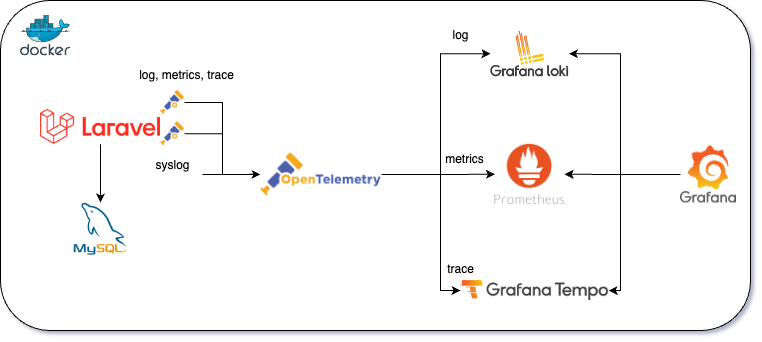

# opentelemetry-laravel-example

OpenTelemetry Laravel Example is a sample application that demonstrates how to use OpenTelemetry in PHP Laravel.

## Architecture



## Installation

Use the docker to install containers.

```bash
cp .env.example .env
docker-compose up
docker-compose exec app composer install
docker-compose exec app php artisan migrate
docker-compose exec app php artisan db:seed
```

## Usage

grafana(ID/PW: admin): http://localhost:3000

app: http://localhost:8080
